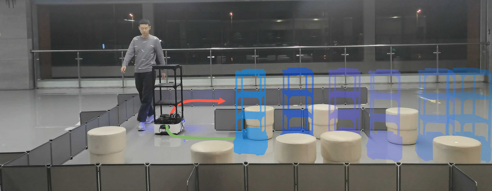

# NaviDiffuser

This is the open-source repo for:

**
NaviDiffuser: Tackling Multi-Objective Robot Navigation by Classifier-Guided Diffusion Model
**            

Xuyang Zhang, Ziyang Feng, Quecheng Qiu, Jie Peng, Haoyu Li, and Jianmin Ji

## Overview

The data-driven paradigm has recently shown great potential in solving many planning tasks. In the robot navigation realm, it sparked a new trend. People believe powerful data-driven methods can learn efficient and general navigation policies from a vast offline dataset. 

However, robot navigation task differs from common planning tasks and presents unique challenges. It often involves multi-objective optimization and needs to meet arbitrary and ever-changing human preferences. 

Furthermore, an effective navigation method needs to overcome short-sighted problems and should have a high frequency of planning in dynamic environments. Both are challenging for data-driven methods. 

In this work, we integrate the diffusion model into robot navigation to address these challenges. Our proposed approach, NaviDiffuser, utilizes the classifier-guided diffusion model for multi-objective solving. Its Transformer backbone outputs action sequences to alleviate short-sightedness. It also includes special distillation skills to boost the planning speed and quality.

We have conducted experiments in both simulated and real-world scenarios to evaluate our approach. In the experiments, NaviDiffuser not only can demonstrate an extremely high arrival rate but also can adjust its navigation policy to align with different human preferences.

## Quick Start

Quick Start will come soon.