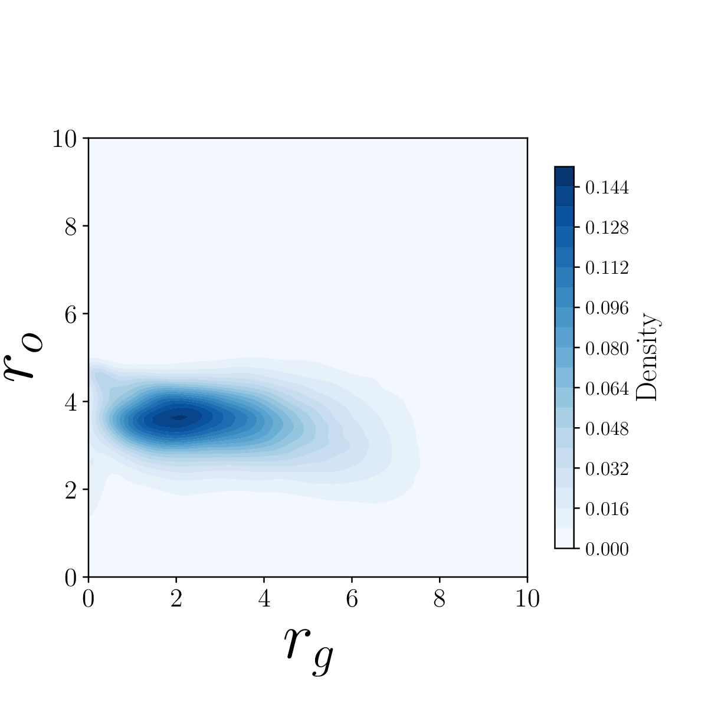
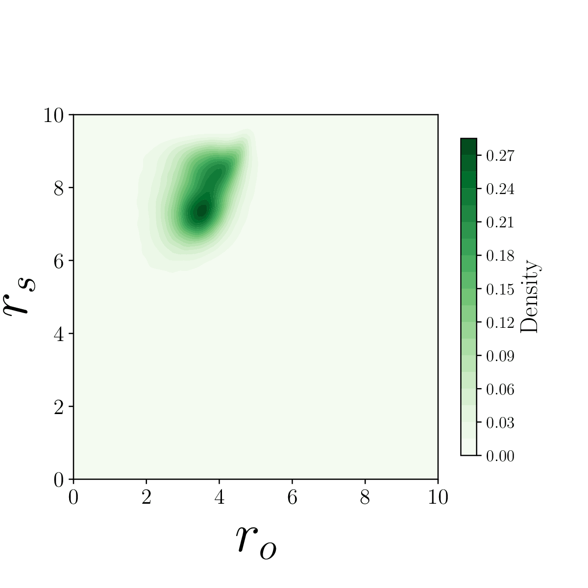
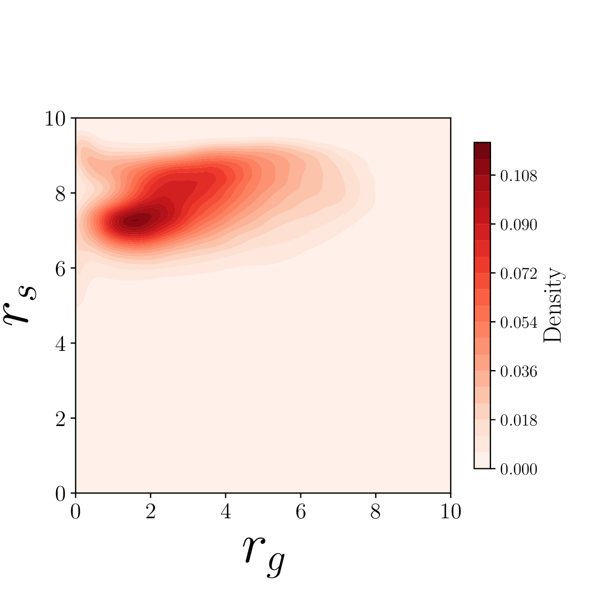

# NaviDiffuser
**NaviDiffuser: Tackling Multi-Objective Robot Navigation by Diffusion Model Decision-Making**            
Xuyang Zhang, Ziyang Feng, Quecheng Qiu, Jie Peng, Haoyu Li, and Jianmin Ji

This is the open-source repo for our thesis.

## Dataset Discussion

We used the dataset created by PPO policy in our work. It is noted that the PPO dataset can be replaced and it is recommended to use the dataset with a wider and more uniform distribution. We used it just because it is enough for training and is easy to build.

We show the distribution of reward vectors in the PPO dataset here: 

To be honest, the distribution is not uniform. The values of $r_o$ are mainly around 4. Most $r_s$ are located in $\left[6, 10\right]$. And the values of $r_g$ are mainly located in $\left[0, 8\right]$. However, for any reward vector value, there are some data to cover it with about 0.02 density. These data are created by the totally random data-collecting environment and are all we need to train our approach.